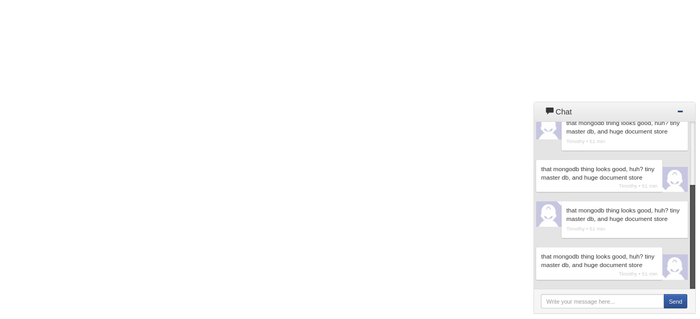

# Meteor+ReactJS

Chat Widget

## CSS

```
<style type="text/css" async>
#widget_container iframe {left:0;top:0;width:100%;height:100%;margin:0;padding:0;display:block;background:transparent;}
#widget_container {transform:none;z-index:9999;right:10px;bottom:5px;position:fixed;overflow:hidden;width:340px;height:480px;}
</style>
```


## JS
```

<script type="text/javascript" async>
	function createWidget(config) {
	var Util = {
		extendObject: function(a, b) {
			for(prop in b){
				a[prop] = b[prop];
			}
			return a;
		},
		proto: 'https:' == document.location.protocol ? 'https://' : 'http://'
	}

	var options = Util.extendObject({
		domain: "localhost:3000",
		client: btoa(document.location.href)
	}, config);

	options.widget_url = [Util.proto, options.domain].join("") + "/" + options.client;

	Widget = {
		created: false,
		widgetElement: null,
		show: function() {
			if (this.created)
				return;
			this.widgetElement = document.createElement('div');
			this.widgetElement.setAttribute('id', 'widget_container');
			this.widgetElement.innerHTML = ' \
				<iframe id="widget_iframe" src="' + options.widget_url + '"frameborder="0"></iframe>';

			document.body.insertBefore(this.widgetElement, document.body.nextSibling);
			this.widgetElement.style.display = 'block';
			this.created = true;
		}
	}
	Widget.show();
}
createWidget();
</script>
```


